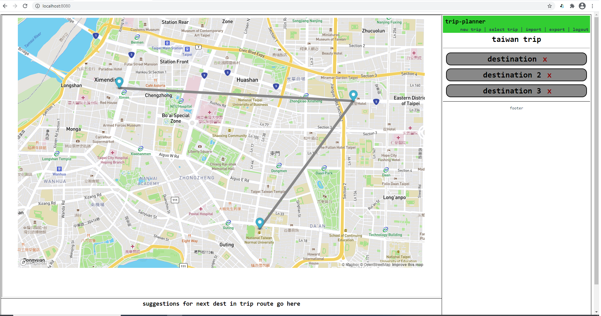
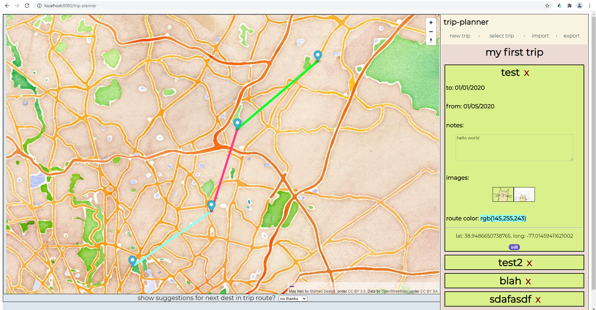
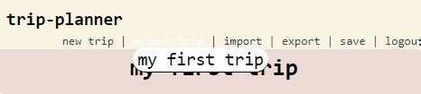
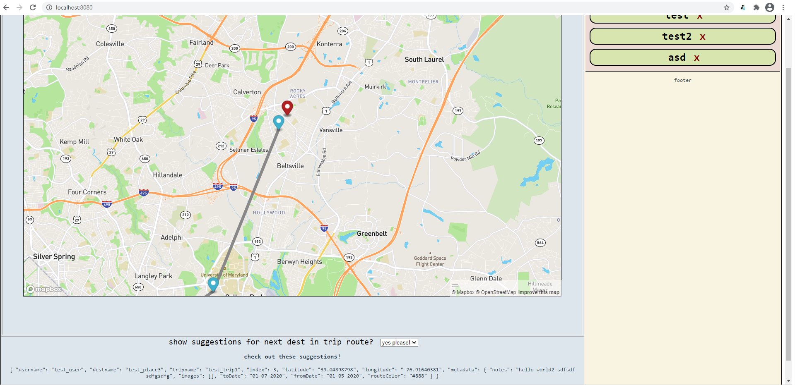
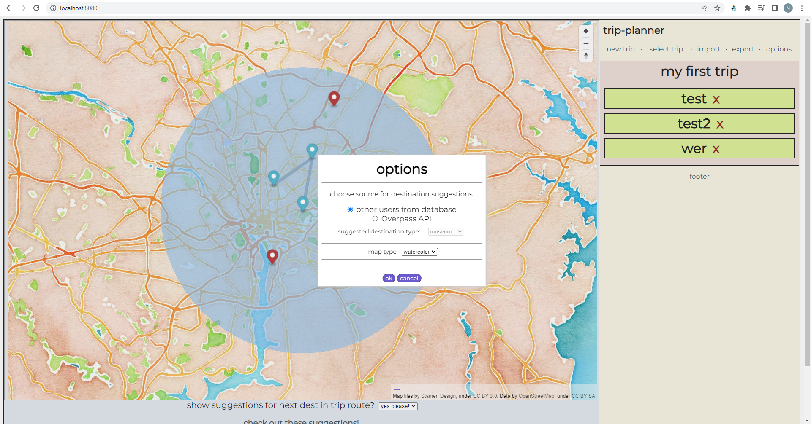

# trip-planner    
    
An application idea to help plan out your future trips or record old ones.    
    
some features include:    
- save trip data as JSON (but any images added will not be saved)
- export trip data as HTML with embedded maps for each destination
- choose between different map styles and UI color themes (not too many choices at the moment though, sorry)
- reorder trip destinations via drag-and-drop
    
One cool (but experimental) feature is that every time you add a new destination to your trip, you have the option of being recommended potential next destinations (which are places in close proximity to your last-added destination, based on destinations of other users in the database). There is also an experimental search feature that leverages the Overpass API to help find nearby locations of a certain category. See the options page to toggle these functionalities.    
    
I think the ideal version of this application would allow users to see and click specific places/landmarks/restaurants/etc. on the map to add as destinations for a trip, kinda like with Google Maps.   
    
This project makes use of the MapBox API, which may need a token for certain features like specific MapBox tiles. You can get a MapBox API token for free (and comes with 50000 free API requests/month). The [Overpass API](https://wiki.openstreetmap.org/wiki/Overpass_API) is also available as an optional source for suggested potential next destinations - thanks very much to all involved for making it available for free!    
    
some screenshots:    
    
the main page    
    
    
destination details   
    
    
choosing a different trip    
    
    
next destination suggestion feature within a particular radius (the red markers are suggestions)    
    
    
option menu    
    
## Project setup
```
npm install
```
    
For setting up the iframe that contains the map, run `npm run setup-map`. This will create a `bundle.js` file used by `mapIframe.html` in `/public` (which contains all the components needed for building the iframe).    
    
If you want to use a MapBox map style, you'll have to add your MapBox API token to `iframeSetup.ts`. Otherwise, I have a default map style and tiles from OpenStreetMap.    
    
### database/api server setup    
For the backend database, I'm using PostgreSQL. For this project my test db is called `trip_planner_test` and I have 2 tables called `users` and `destinations`. I currently don't have any login functionality so the `users` table is not important atm. `destinations` is where all users' destination information is supposed to go. See notes.txt for more info about those tables.    
    
After postgres is setup, see `loadFakeData.js` in `/db_stuff`. Adjust any postgres-specific variables like username/password/database name and run `node loadFakeData.js` to import the data from `test_destinations.json` into the database.    
    
Make sure to run the backend server in `/backend` via `node api-server.js`. The Vue app makes calls for data to this server, which in turn communicates with the database.     
    
### Docker
If you have Docker, you can build the frontend and backend container images via `docker build -t trip-planner .` in the root directory and `docker build -t trip-planner-backend .` in `/backend`. Then, in the root directory, you can run `docker-compose up` to run all the containers, including the PostgreSQL database. Note that currently the database doesn't have any data preloaded though so that needs to be worked out.    
    
If you just want to run the frontend, you can do so with `docker run -d -p 8080:8080 --network=host`.    
    
When the container(s) are running, navigate to `localhost:8080` and you should see the app :).    
    
### Compiles and hot-reloads for development
```
npm run dev
```    
    
Also, everything should work "out-of-the-box" so you can play with the app (without the need to set up the backend) with just `npm run dev`. For the next destination suggestion feature I have some fake suggestions that show up on the map if they're within 20km of your current last trip destination.    
    
### Compiles and minifies for production
```
npm run build
```

### Lints and fixes files
```
npm run lint
```

### Customize configuration
See [Configuration Reference](https://cli.vuejs.org/config/).
