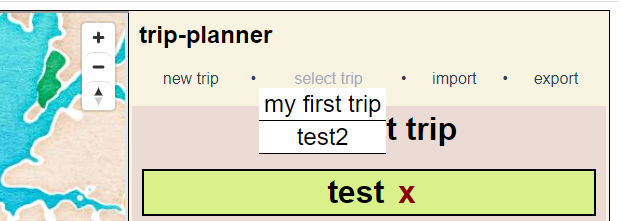

# trip-planner    
    
plan out your future trips! or record old ones. :D currently a work-in-progress!    
this project uses the MapBox API and so you need a token, which you can get for free (and comes with 50000 free API requests/month).    
    
my build is kinda weird right now in that I'm using an iframe to hold the MapBox map, which I'm storing in the public folder and building separately from the rest of the project (I still need to understand how vue-cli works 😅).    
so if you want to try this locally, just add your MapBox token in iframeSetup.ts. Then run `npm run setup-map-dev`, which should build the stuff for the iframe map. Then `npm run serve` will build the whole project and you can see it on `localhost:8080`! :)    
    
some screenshots:    
    
the main page    
    
    
destination details   
    
    
marker tooltip info    
    
    
choosing a different trip (can have multiple trips!)    
    
## Project setup
```
npm install
```

### Compiles and hot-reloads for development
```
npm run serve
```

### Compiles and minifies for production
```
npm run build
```

### Lints and fixes files
```
npm run lint
```

### Customize configuration
See [Configuration Reference](https://cli.vuejs.org/config/).
