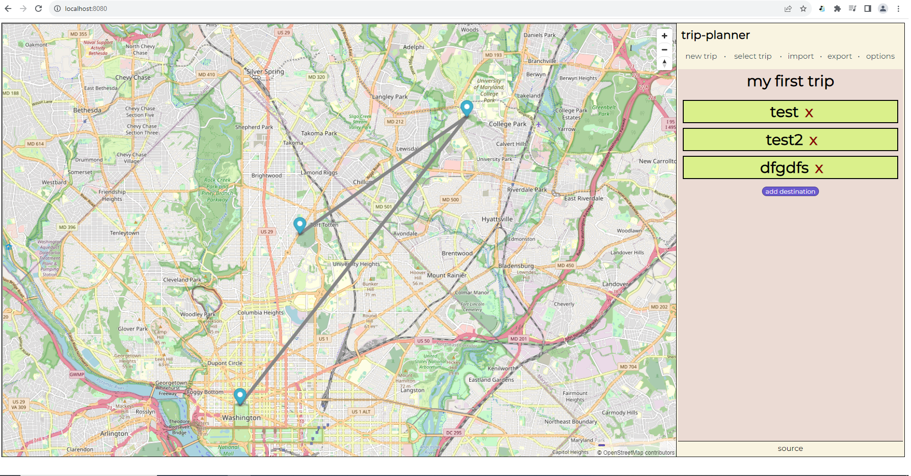

# trip-planner    
    
An experimental application idea to help plan out your future trips! or record old ones. One cool feature is that every time you add a new destination to your trip, you have the option of being recommended potential next destinations (which are places in close proximity to your last-added destination, based on destinations of other users in the database). The ideal version of this application would allow users to see and click specific places/landmarks/restaurants/etc. on the map to add as destinations for a trip.   
    
This project optionally makes use of the MapBox API and so you may need a token, which you can get for free (and comes with 50000 free API requests/month).    
    
My build is kinda weird right now in that I'm using an iframe to hold the MapBox map, which I'm storing in the public folder and building separately from the rest of the project (I still need to understand how vue-cli works 😅).       
    
some screenshots:    
    
the main page    
    
    
destination details   
    
    
marker tooltip info    
    
    
choosing a different trip (can have multiple trips!)    
    
    
next destination suggestion feature (see red marker)    
    
## Project setup
```
npm install
```
    
For setting up the iframe that contains the map, run `npm run setup-map-dev`. This will create a `bundle.js` file used by `mapIframe.html` in `/public`. You'll have to add your MapBox API token to `iframeSetup.ts` first to use a MapBox map style. Otherwise, I have a default map style and tiles that we can use for free thanks to [Stamen Design](http://maps.stamen.com/#terrain/12/37.7706/-122.3782).    
    
### database/api server setup    
For the backend, I went with postgres. For this project my test db is `trip_planner_test` and I have 2 tables called `users` and `destinations`. I currently don't have any login functionality so the `users` table is not important atm. `destinations` is where all users' destination information is supposed to go. See notes.txt for more info about those tables. 

After postgres is setup, see loadFakeData.js, adjust any postgres-specific variables like username/password/database name and run `node loadFakeData.js` to import the data from `test_destinations.json` into the database.    

Make sure to run the backend server via `node api-server.js`. The Vue app makes calls for data to this server, which in turn communicates with the database.     
    
### Compiles and hot-reloads for development
```
npm run serve
```

### Compiles and minifies for production
```
npm run build
```

### Lints and fixes files
```
npm run lint
```

### Customize configuration
See [Configuration Reference](https://cli.vuejs.org/config/).
