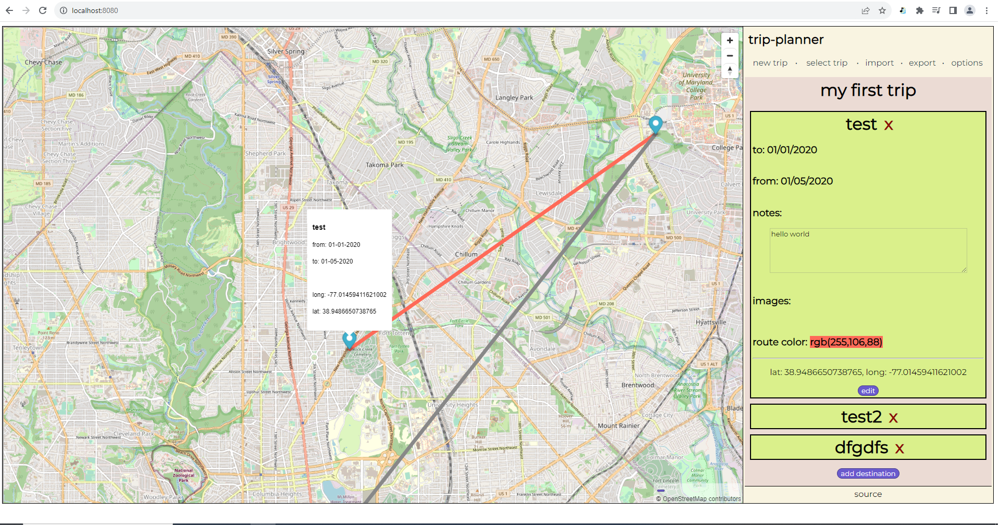
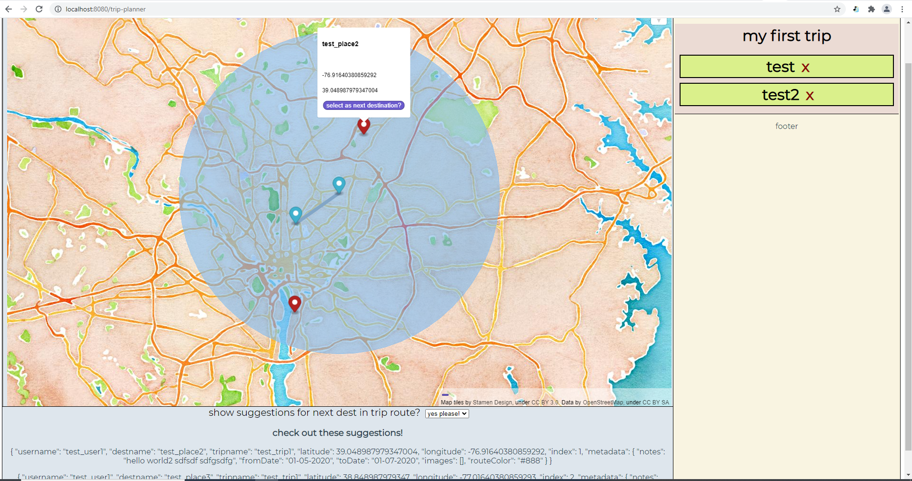
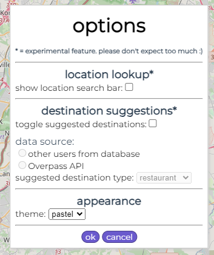

# trip-planner    
    
An experimental application idea to help plan out your future trips or record old ones.    
    
some features include:    
- save trip data as JSON (but any images added will not be saved)
- export trip data as HTML with embedded maps for each destination
- choose between different map styles and UI color themes (not too many choices at the moment though, sorry)
- reorder trip destinations via drag-and-drop
    
One cool (but experimental) feature is that every time you add a new destination to your trip, you have the option of being recommended potential next destinations (which are places in close proximity to your last-added destination, based on destinations of other users in the database). There is also an experimental search feature that leverages the Overpass API to help find nearby locations of a certain category. See the options page to toggle these functionalities.    
    
I think the ideal version of this application would allow users to see and click specific places/landmarks/restaurants/etc. on the map to add as destinations for a trip, kinda like with Google Maps.   
    
This project makes use of the MapBox API, which may need a token for certain features like specific MapBox tiles. You can get a MapBox API token for free (and comes with 50000 free API requests/month). The [Overpass API](https://wiki.openstreetmap.org/wiki/Overpass_API) is also available as an optional source for suggested potential next destinations - thanks very much to all involved for making it available for free!    
    
some screenshots:    
    
the main page    
    
    
destination details   
    
    
choosing a different trip    
    
    
next destination suggestion feature within a particular radius (the red markers are suggestions)    
    
    
option menu    
    
## Project setup
```
npm install
```
    
For setting up the iframe that contains the map, run `npm run setup-map-dev`. This will create a `bundle.js` file used by `mapIframe.html` in `/public` (which contains all the components needed for building the iframe). You'll have to add your MapBox API token to `iframeSetup.ts` first to use a MapBox map style. Otherwise, I have a default map style and tiles that we can use for free thanks to [Stamen Design](http://maps.stamen.com/#terrain/12/37.7706/-122.3782). I'm not sure having a separate build step for the iframe is quite right but for now it works :).    
    
### database/api server setup    
For the backend, I went with PostgreSQL. For this project my test db is called `trip_planner_test` and I have 2 tables called `users` and `destinations`. I currently don't have any login functionality so the `users` table is not important atm. `destinations` is where all users' destination information is supposed to go. See notes.txt for more info about those tables. 

After postgres is setup, see `loadFakeData.js` in the `db_stuff` folder. Adjust any postgres-specific variables like username/password/database name and run `node loadFakeData.js` to import the data from `test_destinations.json` into the database.    

Make sure to run the backend server via `node api-server.js`. The Vue app makes calls for data to this server, which in turn communicates with the database.     
    
### Compiles and hot-reloads for development
```
npm run serve
```    
    
Note that I have a `vue.config.js` file set up such that you'll want to navigate to `http://localhost:8080/trip-planner`.    
    
Also, everything should work "out-of-the-box" so you can play with the app (without the need to set up the backend) with just `npm run serve`. For the next destination suggestion feature I have some fake suggestions that show up on the map if they're within 20km of your current last trip destination.    
    
### Compiles and minifies for production
```
npm run build
```

### Lints and fixes files
```
npm run lint
```

### Customize configuration
See [Configuration Reference](https://cli.vuejs.org/config/).
